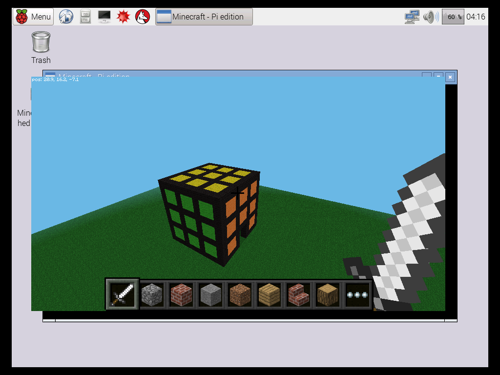
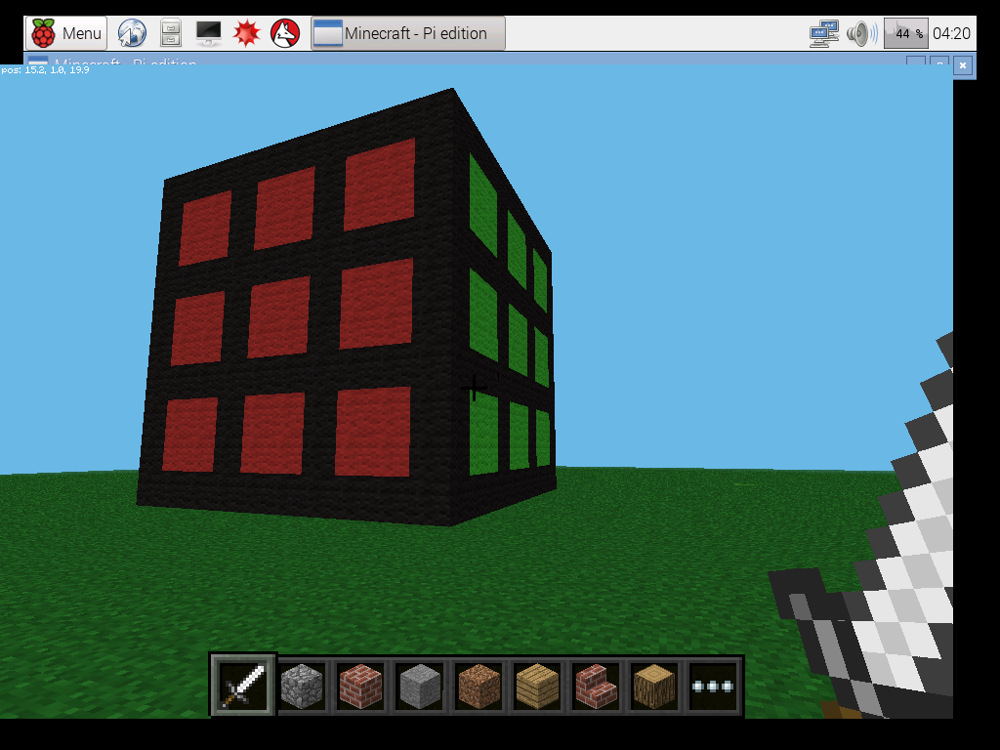
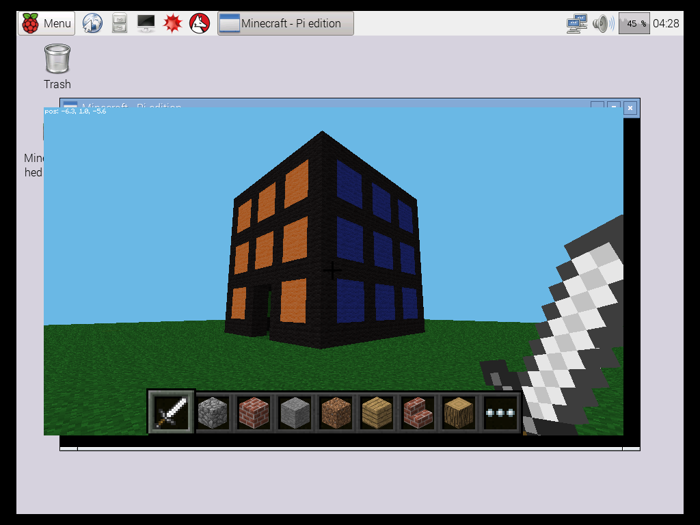

# rubik-kingdom-minecraftpi
This repo contains code for the project of class CE4, of CS2014 taught by Richard Bradley.  
It's a rubik-themed Minecraft Pi mod call **Rubik Kingdom**

The game mod is run on a Raspberry Pi with Minecraft Pi running.
Simply execute the python script while Minecraft is running and you can see the changes made by the script happen in game.
Some screenshots:

You also need to connect the Raspberry Pi with a Numpad to be able to play the mini game: 2D Rubik in the Kingdom.
A video of gameplay demo can be found here: https://photos.app.goo.gl/vdgyWYSnvcIdNKfV2
